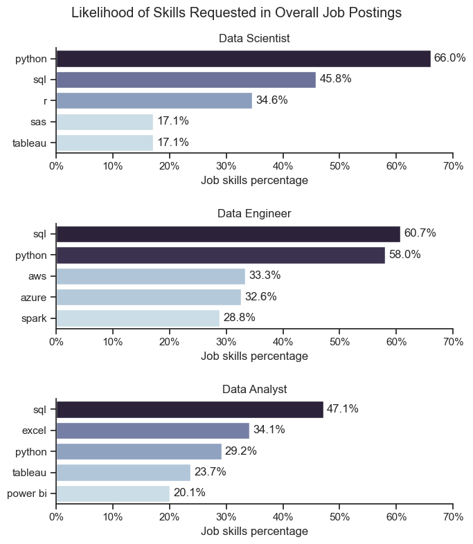
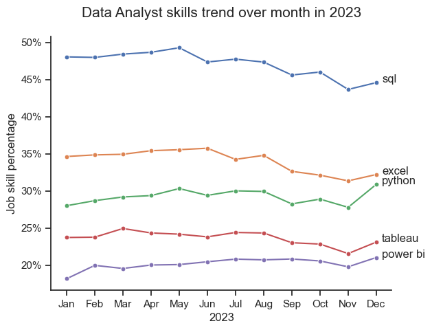
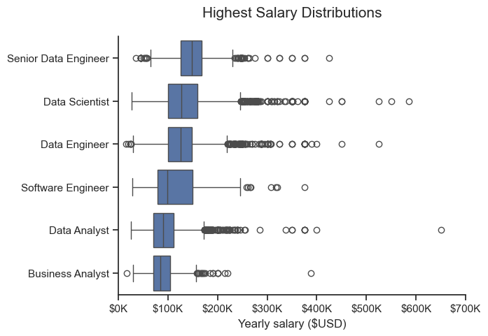
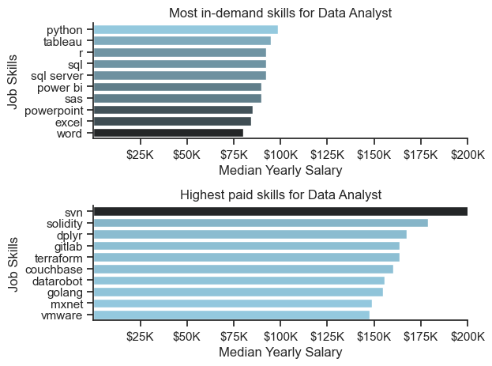
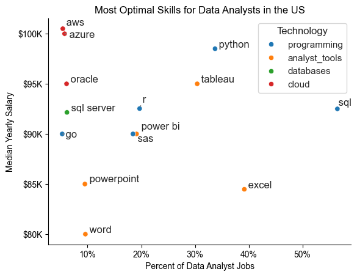

# Project Overview

After taking a Python course on Youtube ([Course here](https://www.youtube.com/watch?v=wUSDVGivd-8&t=36411s)), I want to build this project to demonstrate how far I understand the core function of Python and apply Python in cleaning, analyzing, plotting in Exploratory Data Analysis.

In this project, I used a dataset that I found on Hugging Face, ([Datasource](https://huggingface.co/datasets/lukebarousse/data_jobs)). The dataset "data_jobs" hosted on Hugging Face is focused on data-related job listings. It includes job titles, companies, locations, employment types, and job descriptions. The dataset can be used to analyze trends in the data job market, understand common requirements, or explore salary distributions. It is beneficial for those studying the labor market in the tech industry, especially data science and related fields.

# Tools I used

Through out this course and this project, I will be using Python version 3.12.6 on Jupyter Notebook.
- **Python**: The backbone of my analysis, allowing me to analyze the data and find critical insights.I also used the following Python libraries:
    - **Pandas** Library: used for analyzing, data preparation.
    - **Matplotlib** Library: visualizing data.
    - **Seaborn** Library: customizing charts, graphs.
- **Jupyter Notebooks**: The tool I used to run my Python scripts which let me easily include my notes and analysis.
- **Visual Studio Code**: My go-to for executing my Python scripts.
- **Git & GitHub**: Essential for version control and sharing my Python code and analysis, ensuring collaboration and project tracking.

# Data preparation

First, I am going to load the data from `Hugging Face` using `datasets` library. After loading, I am going to clean up the dataset. As I inspecting the dataset,  at column `job_posted_date` and `job_skills`, it's not the right datatype, it's recognized it as `string` datatype for both columns, so I need to convert `job_posted_date` column into a `datetime` datatype and `job_skills` as a list. View the code below for more specific process.

## Loading and cleaning data
```python
# Importing Libraries
import ast
import pandas as pd
import seaborn as sns
from datasets import load_dataset
import matplotlib.pyplot as plt  

# Loading Data
dataset = load_dataset('lukebarousse/data_jobs')
df = dataset['train'].to_pandas()

# Data Cleanup
df['job_posted_date'] = pd.to_datetime(df['job_posted_date'])
df['job_skills'] = df['job_skills'].apply(lambda skill: ast.literal_eval(skill) if pd.notna(skill) else skill)
```
*This block of code will be executed on every file in this project*

# Insights questions

1. What are the most demanded skills for the top 3 most popular data roles ?
2. How are in-demand skills trending for Data Analysts ?
3. How well do jobs and skills pay for Data Analysts ?
4. What is the most optimal skill to learn for Data Analysts ? (High Demand AND High Paying)

## 1. What are the most demanded skills for the top 3 most popular data roles ?

*View my notebook for detail step by step*: [2_Skill_Demand.ipynb](02_Skill_Demand.ipynb)

To start aggregating to figure out the top 3 most popular data roles, I have to clean up skill column by exploding the list. After that, I use the `size()` method for counting job skills by each role (group by job title) and sort the counting values in descending order. By sorting the count value in descending order, I can now easily take out the top 5 skills for top 3 most popular data roles. This highlights the most popular job titles and their top skills, from this, it showed me which skills I should pay attention to depending on the role I am targeting.

### **Aggregating**
```python
# Explode the job skills
df_skills = df.explode('job_skills').copy()

# Counting job skills by job title and sort it by descending order
df_skills_count = df_skills.groupby(['job_title_short', 'job_skills']).size()
df_skills_count = df_skills_count.reset_index(name='skill_count')
df_skills_count.sort_values(by='skill_count', ascending=False, inplace=True)
```
### **Visualizing**
```python
for i, job_title in enumerate(job_title):
    df_plot = df_skills_pct[df_skills_pct['job_title_short'] == job_title].head(5)
    sns.barplot(
        data=df_plot,
        x='skill_pct',
        y='job_skills',
        ax=ax[i],
        hue='skill_pct',
        palette='ch:s=.25,rot=-.25',
        legend=False
    )
```

### **Results**



### **Insights**

- **Data Scientist**: Python is the most sought-after skill, appearing in 66% of job postings, followed by SQL (45.8%). R, SAS, and Tableau are less frequently mentioned, each at around 17.1%.
- **Data Engineer**: SQL leads at 60.7%, closely followed by Python at 58%. Cloud-related skills like AWS (33.3%) and Azure (32.6%) are also important. Spark is listed in 28.8% of postings.
- **Data Analyst**: SQL is essential, mentioned in 47.1% of postings. Excel (34.1%) and Python (29.2%) are also commonly required. Visualization tools like Tableau (23.7%) and Power BI (20.1%) are also valuable.

Overall, SQL and Python are prominent across all three roles, with specialized tools and cloud skills more significant for specific positions.

## 2. How are in-demand skills trending for Data Analysts ?

*View my notebook for step by step*: [3_Skill_Trend.ipynb](03_Skill_Trend.ipynb)

For this question, I want to figure out how in-demand skills (counting each skill by job postings) are monthly trended.

I only look for Data Analyst skills and grouped each top skills by month of the job posting date. This gave me the top 5 skills of Data Analysts by month, showing how popular skills were throughout 2023.

### **Aggregating**

#### *Skill counting*

```python
# Skill counting
df_exploded = df[df['job_title_short'] == 'Data Analyst'].explode('job_skills').copy()
df_exploded['job_posted_month'] = df_exploded['job_posted_date'].dt.month
df_DA_pivot = df_exploded.pivot_table(index='job_posted_month', columns='job_skills', aggfunc='size', fill_value=0)

# sorting skils count value
df_DA_pivot.loc['Total'] = df_DA_pivot.sum()
df_DA_pivot = df_DA_pivot[df_DA_pivot.loc['Total'].sort_values(ascending=False).index]
df_DA_pivot = df_DA_pivot.drop('Total')

# Top 5 skills
df_DA_pivot = df_DA_pivot.iloc[:, :5]
```

#### *Skill counting percentage*

```python
# Skills counting percentage
df_DA_total = df_DA.groupby('job_posted_month').size()
df_pivot_DA = df_pivot_DA.div(df_DA_total/100, axis=0)

# Top 5 skills
df_pivot_DA = df_pivot_DA.iloc[:, :5]
```

### **Visualizing**

```python
sns.lineplot(
    data=df_pivot_DA,
    dashes=False,
    legend=False,
    markers='o',
    markersize=5
)
ax.yaxis.set_major_formatter(plt.FuncFormatter(lambda x,pos: f"{int(x/1000)}K"))
```

### **Results**



### **Insights**
- **SQL** remained the most sought-after skill throughout 2023, consistently above 45% but showed a slight decline towards the year's end.
- **Excel** held steady at around 35%, with a mild fluctuation and a slight dip in the latter part of the year.
- **Python** maintained a stable trend around 30% with minor variations.
- **Tableau** and **Power BI** had the lowest percentages, fluctuating around 20-25%, and both experienced a downward trend in the last months of 2023.

Overall, core data analysis skills like **SQL** and **Excel** are consistently prioritized.

## 3. How well do jobs and skills pay for Data Analysts ?

*View my notebook for step by step*: [4_Salary_Analysis.ipynb](04_Salary_Analysis.ipynb)

For this question I want to figure out the salary distributions of top 6 job has highest median salary. Then I narrow it down just to compare the salary between top paid skills vs most in-demand skills for Data Analyst

### **Aggregating**

```python
# Identifying top 6 job roles
df_salary_distributions = df.copy()
top_roles = df_salary_distributions['job_title_short'].value_counts().head(6).index.tolist()
df_top_roles = df_salary_distributions[df['job_title_short'].isin(top_roles)]

# DataFrame for plotting Highest Salary Distributions
df_salary_top_roles = df_top_roles[['job_title_short','salary_year_avg']]

# DataFrame for plotting Top paid skills vs Most in-demand skills in Salary
df_skills_count_median = df_DA.groupby('job_skills')['salary_year_avg'].agg(['count','median'])
df_demand_skills = df_skills_count_median.sort_values(by='count', ascending=False).head(10).sort_values(by='median',ascending=False)
df_top_paid = df_skills_count_median.sort_values(by='median', ascending=False).head(10)
```

### **Visualizing**

```python
# Plotting Highest Salary Distributions
sns.boxplot(
    data=df_salary_top_roles,
    x='salary_year_avg',
    y='job_title_short',
    order=job_order
)
```

**Plotting Top paid skills vs Most in-demand skills in Salary**

```python
# Top in-demand skills
sns.barplot(
    data=df_demand_skills,
    x='median',
    y='job_skills',
    hue='median',
    palette='dark:skyblue',
    legend=False,
    ax=ax[0]
)

# Top paid skills
sns.barplot(
    data=df_top_paid,
    x='median',
    y='job_skills',
    hue='median',
    palette='dark:skyblue_r',
    legend=False,
    ax=ax[1]
)

plt.show()
```

### **Results**





### **Insights**

#### Highest Salary Distributions

- **Senior Data Engineer** roles show the highest median salary and the widest range, with salaries extending up to $600K and some outliers around $700K.
- **Data Scientist** and **Data Engineer** roles also have high median salaries, reaching close to $200K, with distributions suggesting substantial high-end outliers.
- **Software Engineer** salaries are similarly competitive but show fewer extreme outliers compared to data-centric roles.
- **Data Analyst** and **Business Analyst** roles have lower median salaries, around $100K, with fewer high outliers.

Overall, engineering and data science roles command the highest earnings, while analyst positions offer more modest ranges.

#### Top paid skills vs Most in-demand skills in Salary

**Most In-Demand Skills:**

- `Python`, `Tableau`, and `SQL` are the clear leaders in terms of demand. Their bars extend significantly beyond the others, indicating a high level of interest from employers.
- `SQL Server`, `Power BI`, and `SAS` follow closely behind, suggesting strong demand for skills in database management and data visualization tools.
- P`owerPoint`, `Excel`, and Word are essential for any professional role, including Data Analysts, and their inclusion in the list highlights their importance.

**Highest-Paid Skills:**

- `Solidity` takes the top spot with the highest median yearly salary. This indicates a significant demand for professionals with expertise in this programming language, likely related to blockchain and cryptocurrency development.
- `SVN`, `Dplyr`, `Gitlab`, `Terraform`, `Couchbase`, `Datarobot`, `Golang`, `MXNet`, and `Vmware` follow, with varying degrees of demand and salary potential. These skills are likely related to data engineering, machine learning, and cloud infrastructure.

## 4. What is the most optimal skill to learn for Data Analysts ? (High Demand AND High Paying)

In order to identify which skills are the most optimal to learn (the ones that are both highest paid and most in-demand), I calculated it by the percentage skills demand and the median yearly salary.

### **Aggregating**

```python
df_DA_skills = df_DA_exploded.groupby('job_skills')['salary_year_avg'].agg(['count','median']).sort_values(by='count', ascending=False)
df_DA_skills = df_DA_skills.rename(columns={'count': 'skill_count', 'median': 'median_salary'})
DA_job_count = len(df_DA)
df_DA_skills['skill_pct'] = df_DA_skills['skill_count'] / DA_job_count * 100
skill_pct = 5
df_DA_skills_high_demand = df_DA_skills[df_DA_skills['skill_pct'] > skill_pct]
```

### **Visualizing**

```python
# Plotting
sns.scatterplot(
    data=df_DA_plot,
    x='skill_pct',
    y='median_salary',
    hue='technology'
)

# Labeling
texts = []
for i, txt in enumerate(df_DA_skills_high_demand.index):
    texts.append(plt.text(df_DA_skills_high_demand['skill_pct'].iloc[i], df_DA_skills_high_demand['median_salary'].iloc[i], " " + txt))
```

### **Results**



### **Insights**

- **High-Paying, Low-Demand Skills**: `AWS` and `Azure` offer top salaries (~$100K) but appear in less than 10% of job postings. Specialized but valuable.
- **Valuable Database Skills**: `Oracle` and `SQL Server` also pay well ($95K) with moderate demand. `SQL`, while lower-paid ($90K), is essential, appearing in over 50% of postings.
- **In-Demand Programming & Tools**: `Python` and Tableau are widely needed (20-30%) and offer solid salaries (~$90K+). `R`, `Power BI`, and `SAS` are useful but less demanded.
- **High-Demand, Lower-Paying Skills**: `Excel` is in 40% of jobs but has a lower salary (~$85K). `PowerPoint` and `Word` are less valuable in pay and demand.

Focus on high-demand foundational skills (`SQL`, `Python`) and pair with high-paying, specialized skills (`AWS`, `Azure`) and visualization tools (`Tableau`, `Power BI`) to maximize earnings.
